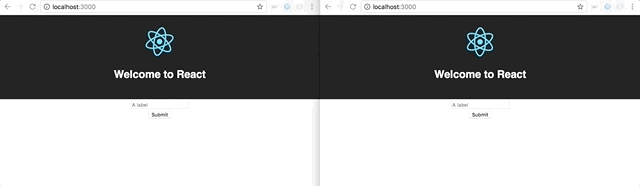

# Build a realtime web application with GraphQL, Apollo and React

Realtime has opened new opportunities in web applications.
By allowing users to get access to data as soon as it’s available, it provides them a better experience.
Thanks to realtime, you can edit documents together, play online with your friends, know exactly when your pizza delivery man will arrive or when you will arrive at destination depending of the current traffic.

In the past, implementing real time had a huge cost and was reserved for top companies like Google or Facebook, but nowadays, emergence of realtime technologies and libraries makes it accessible to anyone.

GraphQL has integrated realtime in its specification with Subscriptions. That means that you can use realtime inside the same api you use for the rest of your application, providing an unique source of communication and a better organization.

In this tutorial, you will see how to implement a realtime web application with few lines of codes, using GraphQL, Apollo and React.

In order to accomplish this goal, we will build a notification system from scratch in two parts, first we will implement a GraphQL NodeJS express server. Then we will realize the front web application with React.

The code referring to this article can be found on [GitHub](https://github.com/loic-carbonne/realtime-notifications-apollo-graphql/)

## 1. The server

### 1.1. Bootstrap the GraphQL server

Let's start with the initiation of the server.
Create a new folder and write the following commands inside:

 * `npm init` or `yarn init` to generate the *package.json* file

 * `npm --save add express body-parser apollo-server-express graphql-tools` or `yarn add express body-parser apollo-server-express graphql-tools` to install required libraries.

Create a new file *index.js*:
```javascript
const express = require('express');
const bodyParser = require('body-parser');
const { graphqlExpress, graphiqlExpress } = require('apollo-server-express');
const { makeExecutableSchema } = require('graphql-tools');

const notifications = [];
const typeDefs = `
  type Query { notifications: [Notification] }
  type Notification { label: String }
`;
const resolvers = {
  Query: { notifications: () => notifications },
};
const schema = makeExecutableSchema({ typeDefs, resolvers });

const app = express();
app.use('/graphql', bodyParser.json(), graphqlExpress({ schema }));
app.use('/graphiql', graphiqlExpress({ endpointURL: '/graphql' }));
app.listen(4000, () => {
  console.log('Go to http://localhost:4000/graphiql to run queries!');
});
```
Congratulations, you have just created a GraphQL server with Express and Apollo!

You can launch it with the command: `node index.js`.

In this server, we added a GraphQL query named *notifications* that allows us to get all notifications.
You can test it with GraphiQL, by going to the adress [http://localhost:4000/graphiql](http://localhost:4000/graphiql) and sending the following query (it should return an empty array because there is no notifications available yet):
```
query {
  notifications {
    label
  }
}
```
The corresponding commit is available [here](https://github.com/loic-carbonne/realtime-notifications-apollo-graphql/commit/b27e3009b5fd22a1981c679e210e111f6cea1152).

### 1.2. Add a mutation to the server

Next, let's add a mutation that permits to push notifications.
Update type definitions and resolvers in *index.js*:
```javascript
...
const typeDefs = `
  type Query { notifications: [Notification] }
  type Notification { label: String }
  type Mutation { pushNotification(label: String!): Notification }
`;
const resolvers = {
  Query: { notifications: () => notifications },
  Mutation: {
      pushNotification: (root, args) => {
        const newNotification = { label: args.label };
        notifications.push(newNotification);

        return newNotification;
      },
  },
};
...
```
The *pushNotification* mutation is ready. You can test it in GraphiQL, with:
```
mutation {
  pushNotification(label:"My first notification") {
    label
  }
}
```

Click [here](https://github.com/loic-carbonne/realtime-notifications-apollo-graphql/commit/79e6a1a3251a2d4a0b19b08d301c206a997878c7) for the commit.

### 1.3. Add subscriptions

The last step in the building of the server is adding the subscription, to make our server going to realtime.

Add the required libraries to use subscriptions: `npm install --save graphql-subscriptions http subscriptions-transport-ws cors` or `yarn add graphql-subscriptions http subscriptions-transport-ws cors`

Then add the subscription *newNotification* in the GraphQL schema:
```javascript
const { PubSub } = require('graphql-subscriptions');

const pubsub = new PubSub();
const NOTIFICATION_SUBSCRIPTION_TOPIC = 'newNotifications';
...
  type Mutation { pushNotification(label: String!): Notification }
  type Subscription { newNotification: Notification }
`;
const resolvers = {
  Query: { notifications: () => notifications },
  Mutation: {
      pushNotification: (root, args) => {
        const newNotification = { label: args.label };
        notifications.push(newNotification);

        pubsub.publish(NOTIFICATION_SUBSCRIPTION_TOPIC, { newNotification });
        return newNotification;
      },
  },
  Subscription: {
    newNotification: {
      subscribe: () => pubsub.asyncIterator(NOTIFICATION_SUBSCRIPTION_TOPIC)
    }
  },
};
const schema = makeExecutableSchema({ typeDefs, resolvers });
```
* Declare a PubSub and a topic corresponding to the new Subscription
* Declare the type definition of the new Subscription called *newNotification*
* Every time a new notification is sent via the *pushNotification* mutation, publish to PubSub with the relevant topic
* Sync the new notification Subscription with all events from PubSub instance corresponding to relevant topic

Finally, update the server configuration to provide Subscriptions via WebSockets.

```javascript
const cors = require('cors');
const { execute, subscribe } = require('graphql');
const { createServer } = require('http');
const { SubscriptionServer } = require('subscriptions-transport-ws');
...
const app = express();
app.use('*', cors({ origin: `http://localhost:3000` })); // allows request from webapp
app.use('/graphql', bodyParser.json(), graphqlExpress({ schema }));
app.use('/graphiql', graphiqlExpress({
  endpointURL: '/graphql',
  subscriptionsEndpoint: `ws://localhost:4000/subscriptions`
}));
const ws = createServer(app);
ws.listen(4000, () => {
  console.log('Go to http://localhost:4000/graphiql to run queries!');

  new SubscriptionServer({
    execute,
    subscribe,
    schema
  }, {
    server: ws,
    path: '/subscriptions',
  });
});
```

The server is ready, you can test the new Subscription with GraphiQL.
Use the following query to display new notifications on a windows.
```
subscription {
  newNotification {
    label
  }
}
```
And in another windows, if you push notifications via the mutation created before, you should see data from the subscription being updated.


You can find relevant commit [here](https://github.com/loic-carbonne/realtime-notifications-apollo-graphql/commit/2cb852cffeb40a927f4386d591d2bcdaf9057dc4)

## 2. The React web application

### 2.1. Bootstrap the React app

Bootstrap the front-end application with [Create React App](https://github.com/facebook/create-react-app):

`npx create-react-app frontend`

Corresponding commit [here](https://github.com/loic-carbonne/realtime-notifications-apollo-graphql/commit/b6c0a56860f97512c2e1811ec95147fa0b1efd90)

### 2.2. Add mutation to push notifications

Next, we will set up Apollo Client to communicate with the GraphQL server.

Install the required libraries: `npm install --save apollo-boost react-apollo graphql` or `yarn add apollo-boost react-apollo graphql`

Update *index.js*
```javascript
...
import { ApolloProvider } from 'react-apollo'
import { ApolloClient } from 'apollo-client'
import { HttpLink } from 'apollo-link-http'
import { InMemoryCache } from 'apollo-cache-inmemory'

const client = new ApolloClient({
  link: new HttpLink({ uri: 'http://localhost:4000/graphql' }),
  cache: new InMemoryCache()
})

ReactDOM.render(
  <ApolloProvider client={client}>
    <App />
  </ApolloProvider>,
  document.getElementById('root')
);
```

Then create a new component *PushNotification* that will be used to send *pushNotification* mutation.

*PushNotification.js*
```javascript
import React, { Component } from 'react'
import { graphql } from 'react-apollo'
import gql from 'graphql-tag'

class PushNotification extends Component {
  state = { label: '' }

  render() {
    return (
      <div>
        <input
          value={this.state.label}
          onChange={e => this.setState({ label: e.target.value })}
          type="text"
          placeholder="A label"
        />
        <button onClick={() => this._pushNotification()}>Submit</button>
      </div>
    )
  }

  _pushNotification = async () => {
    const { label } = this.state
    await this.props.pushNotificationMutation({
      variables: {
        label
      }
    })
    this.setState({ label: '' });
  }
}

const POST_MUTATION = gql`
mutation PushNotificationMutation($label: String!){
  pushNotification(label: $label) {
    label
  }
}
`

export default graphql(POST_MUTATION, { name: 'pushNotificationMutation' })(PushNotification)
```
* As the component is wrapped by `graphql(POST_MUTATION, { name: 'pushNotificationMutation' })(PushNotification)`, this component has a props pushNotification() that can be used to call the mutation.

Then call *PushNotification* in *AppComponent*

```javascript
import PushNotification from 'PushNotification'
...
  <div className="App-intro">
    <PushNotification/>
  </div>
...
```

We can now push notification from the React application! We can check that notifications are sended to the server with GraphiQL.

Corresponding commit is [here](https://github.com/loic-carbonne/realtime-notifications-apollo-graphql/commit/52206c84cb4802cd778aa270be5cd6b2c8839049)

### 2.3. Add subscription to get realtime notifications

The last step is allowing subscriptions in the React application.

Install the required dependencies: `npm install --save apollo-link-ws react-toastify` or `yarn add apollo-link-ws react-toastify`.
* [apollo-link-ws](https://www.npmjs.com/package/apollo-link-ws) enables to send GraphQL operation over WebSockets.
* [React Toastify](https://github.com/fkhadra/react-toastify) will be used to push toasts when a notification is received

Then update Apollo Client configuration to use WebSockets

*index.js*
```javascript
...
import { split } from 'apollo-link';
import { WebSocketLink } from 'apollo-link-ws';
import { getMainDefinition } from 'apollo-utilities';

const httpLink = new HttpLink({ uri: 'http://localhost:4000/graphql' });

const wsLink = new WebSocketLink({
  uri: `ws://localhost:4000/subscriptions`,
  options: {
    reconnect: true
  }
});

const link = split(
  ({ query }) => {
    const { kind, operation } = getMainDefinition(query);
    return kind === 'OperationDefinition' && operation === 'subscription';
  },
  wsLink,
  httpLink,
);

const client = new ApolloClient({
  link,
  cache: new InMemoryCache()
})
...
```

And wrap the main App component with the query corresponding to the subscription.

```javascript
import { graphql } from 'react-apollo'
import gql from 'graphql-tag'
import { ToastContainer, toast } from 'react-toastify';

class App extends Component {
  componentWillReceiveProps({ data: { newNotification: { label } } }) {
    toast(label);
  }
  render() {
    return (
      <div className="App">
        ...
        <ToastContainer />
      </div>
    );
  }
}

const subNewNotification = gql`
  subscription {
    newNotification {
      label
    }
  }
`;

export default graphql(subNewNotification)(App);
```
* When a component is wrapped with a Subscription, it automatically receives data from the subscription in its props.
* Another method to receive data from Subscription is using [subscribeToMore](https://www.apollographql.com/docs/react/features/subscriptions.html#subscribe-to-more). This useful method merges the different received objects in your component state with other objects from classic GraphQL queries.

The notification system is now finished!



Final commit [here](https://github.com/loic-carbonne/realtime-notifications-apollo-graphql/commit/4f762af907907269fa7737e0f44d658e3b0e9f42)

## Conclusion

During this tutorial, we learnt how to build a realtime notification system from scratch with GraphQL, Apollo and express.
The current system is basic, next step could be adding authentification to push notification only to specific user.

To go further, I highly recommend:
- [How to GraphQL](https://www.howtographql.com/)
- [Apollo Docs](https://www.apollographql.com/docs/react/index.html)

Don't hesitate to give feedback, or share your experiences with realtime GraphQL in comments.
